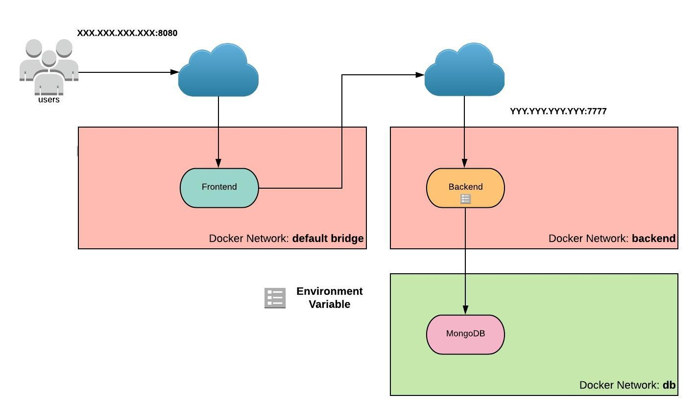
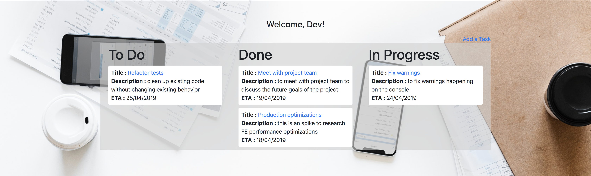

# Introduction

In this challenge, you will take an existing application (a React TODO app), containerize it and deploy it to a Docker host on AWS. In order to do that, you will need an account on [DockerHub](https://hub.docker.com/). If you do not have an account on DockerHub, please create one before starting the challenge.

# Cloning the repository

As a first step, let's clone the repository with all the files you will need to start this challenge. Please, clone it in your **local machine**. This is the URL for the repository: https://github.com/slalomdojo/docker

If you are using the terminal, you can run the following command:

```
git clone https://github.com/slalomdojo/docker
```

After cloning the repository and cd'ing into it, you should see the following files and folders:

```
$ ls -la
total 8
drwxr-xr-x   7 staff  staff  238 May  8 15:45 .
drwxr-xr-x   3 staff  staff  102 May  8 15:45 ..
drwxr-xr-x  12 staff  staff  408 May  8 15:45 .git
-rw-r--r--   1 staff  staff   27 May  8 15:45 README.md
drwxr-xr-x   3 staff  staff  102 May  8 15:45 backend
drwxr-xr-x   3 staff  staff  102 May  8 15:45 database
drwxr-xr-x   8 staff  staff  272 May  8 15:45 frontend
drwxr-xr-x   6 staff  staff  204 May  8 15:45 images
```

Now let's start the challenge!

# Architecture



The architecture of this application is quite simple. At the end of this challenge, there will be 3 (three) containers:

* Frontend (client application)
* Backend (server application)
* Database (MongoDB)

Even though in the image each container is in a separate "space", they're all running on the **same** host. However! Each container is running on a separate Docker network. Don't worry, we'll talk about Docker network very soon. Let's start with the Frontend

# Frontend (Client Application)

The **frontend** folder contains all the files needed in order to run the **client application**. Since the goal of this challenge is to create Docker containers, let's create a Docker image for this application.

## Dockerfile

To create a Docker image, you will need a **Dockerfile**. Here's the Dockerfile you have in the **frontend** directory:

```
FROM <IMAGE>

RUN <COMMANDS>

COPY <SRC> <DEST>

CMD [ "executable" ]

```

This Dockerfile is simply a template and is currently not doing anything. Use the following information to fill out the Dockerfile:

* Base image: node:carbon (see [FROM](https://docs.docker.com/engine/reference/builder/#from))
* Copy the current directory (.) to /code (see [COPY](https://docs.docker.com/engine/reference/builder/#copy))
* Make /code the Working Directory (see [WORKDIR](https://docs.docker.com/engine/reference/builder/#workdir))
* Install all the dependencies: **npm install** (see [RUN](https://docs.docker.com/engine/reference/builder/#run))
* Run the following command when the container comes up: **npm run dev** (see [CMD](https://docs.docker.com/engine/reference/builder/#cmd))

When you're done, **build** the image:

```
docker build -t dd-fe .
```

PS 1: The `-t` option is for *tagging*. In this case `dd-fe` is the name of your image.

PS 2: The dot (.) at the end indicates to Docker that the Dockerfile is in the current directory.

To run the container:

```
docker run --rm dd-fe

> docker-dojo-fe@1.0.0 dev /code
> webpack-dev-server --open --host 0.0.0.0 --port 8080

ℹ ｢wds｣: Project is running at http://0.0.0.0:8080/
ℹ ｢wds｣: webpack output is served from /
ℹ ｢wds｣: 404s will fallback to /index.html
⚠ ｢wds｣: Unable to open browser. If you are running in a headless environment, please do not use the --open flag
[BABEL] Note: The code generator has deoptimised the styling of /code/node_modules/react-dom/cjs/react-dom.development.js as it exceeds the max of 500KB.
ℹ ｢wdm｣: Hash: 104d1215cdcac375e62e
Version: webpack 4.30.0
Time: 4349ms
Built at: 2019-05-08 20:44:58
                               Asset      Size  Chunks             Chunk Names
291a9d331c48885d1d8c9e13e0ae0a0b.jpg   457 KiB          [emitted]
                           bundle.js  1.64 MiB    main  [emitted]  main
Entrypoint main = bundle.js
[0] multi (webpack)-dev-server/client?http://0.0.0.0:8080 ./src/app 40 bytes {main} [built]
[./node_modules/ansi-html/index.js] 4.26 KiB {main} [built]
[./node_modules/loglevel/lib/loglevel.js] 6.84 KiB {main} [built]
[./node_modules/querystring-es3/index.js] 126 bytes {main} [built]
[./node_modules/react-dom/index.js] 1.32 KiB {main} [built]
[./node_modules/react/index.js] 189 bytes {main} [built]
[./node_modules/strip-ansi/index.js] 162 bytes {main} [built]
[./node_modules/url/url.js] 22.2 KiB {main} [built]
[./node_modules/webpack-dev-server/client/index.js?http://0.0.0.0:8080] (webpack)-dev-server/client?http://0.0.0.0:8080 8.26 KiB {main} [built]
[./node_modules/webpack-dev-server/client/overlay.js] (webpack)-dev-server/client/overlay.js 3.59 KiB {main} [built]
[./node_modules/webpack-dev-server/client/socket.js] (webpack)-dev-server/client/socket.js 1.05 KiB {main} [built]
[./node_modules/webpack/hot sync ^\.\/log$] (webpack)/hot sync nonrecursive ^\.\/log$ 170 bytes {main} [built]
[./node_modules/webpack/hot/emitter.js] (webpack)/hot/emitter.js 75 bytes {main} [built]
[./src/app/components/Main.jsx] 1.36 KiB {main} [built]
[./src/app/index.jsx] 184 bytes {main} [built]
    + 159 hidden modules
ℹ ｢wdm｣: Compiled successfully.
```

If you see `Compiled successfully`, that means everything worked. Kill the container (press CTRL + C one or multiple times) and move on to the next section. Otherwise, please let one of the organizers know.

## Pushing to DockerHub

Right now, the container is running on your local machine. What we really want is to deploy it to a remote Docker host on AWS. In order to do that, let's push the image you've built to DockerHub, then you can ssh into the Docker host and deploy the container there.

Try the following command to push the image:

```
docker push dd-fe 
```

You probably got the following message:

```
denied: requested access to the resource is denied
```

Read the following documentation to understand how to push an image to DockerHub: [https://docs.docker.com/docker-hub/repos/](https://docs.docker.com/docker-hub/repos/). You can also have a chat with your colleagues and the organizers. Come back to the challenge when the image is pushed.

## Deploying to the remote Docker host

For this challenge, each team will be provided with a remote Docker host (i.e., an EC2 instance on AWS which has Docker installed on it). This will be where you will deploy the application.

The steps below show how you can ssh into this instance.

Issue the following Docker command in your local terminal:

```
docker run --rm -it -e "URL1=<URL1>" slalomdojo/env:docker
```

The command above will spin up a container using the *slalomdojo/env* image and tag *docker*. You will also notice that you need to specify one environment variable: **URL1** (you should've been given this information in the beginning of the challenge). If your Docker command fails, please reach out to one of the organizers.

Once you are in the container, ssh into the Docker host (the Public IP of the instance has also been given to you):

```
$ ssh -i ~/.ssh/private ec2-user@<PUBLIC-IP>
The authenticity of host 'XXX.XXX.XXX.XXX (XXX.XXX.XXX.XXX)' can't be established.
ECDSA key fingerprint is SHA256:XXXXXXXXXXXXXXXXXXXXXXXXXXXXXXXXXXXXXXXXXX.
Are you sure you want to continue connecting (yes/no)? yes

       __|  __|_  )
       _|  (     /   Amazon Linux 2 AMI
      ___|\___|___|

https://aws.amazon.com/amazon-linux-2/
[ec2-user@ip-172-21-0-33 ~]$
```

Now that you're in the host, run the following to make sure Docker is working:

```
[ec2-user@ip-172-21-0-33 ~]$ docker run hello-world

Unable to find image 'hello-world:latest' locally
latest: Pulling from library/hello-world
1b930d010525: Pull complete
Digest: sha256:92695bc579f31df7a63da6922075d0666e565ceccad16b59c3374d2cf4e8e50e
Status: Downloaded newer image for hello-world:latest

Hello from Docker!
This message shows that your installation appears to be working correctly.

To generate this message, Docker took the following steps:
 1. The Docker client contacted the Docker daemon.
 2. The Docker daemon pulled the "hello-world" image from the Docker Hub.
    (amd64)
 3. The Docker daemon created a new container from that image which runs the
    executable that produces the output you are currently reading.
 4. The Docker daemon streamed that output to the Docker client, which sent it
    to your terminal.

To try something more ambitious, you can run an Ubuntu container with:
 $ docker run -it ubuntu bash

Share images, automate workflows, and more with a free Docker ID:
 https://hub.docker.com/

For more examples and ideas, visit:
 https://docs.docker.com/get-started/
```

If you got the `Hello from Docker` message back, you're good to go!

Now let's pull the image you pushed to DockerHub:

```
docker pull <frontend-image-name>
```

Run `docker images` to confirm the image was pulled successfully. Next, run the container:

```
docker run -d <frontend-image-name>
```

After you run this command, you will see a hash (i.e. the container ID). Copy that hash and run:

```
docker logs -f <hash>
```

The command above will show the output of the client application. When you see:

```
(...)
[0] multi (webpack)-dev-server/client?http://0.0.0.0:8080 ./src/app 40 bytes {main} [built]
[./node_modules/ansi-html/index.js] 4.26 KiB {main} [built]
[./node_modules/loglevel/lib/loglevel.js] 6.84 KiB {main} [built]
[./node_modules/querystring-es3/index.js] 126 bytes {main} [built]
[./node_modules/react-dom/index.js] 1.32 KiB {main} [built]
[./node_modules/react/index.js] 189 bytes {main} [built]
[./node_modules/strip-ansi/index.js] 162 bytes {main} [built]
[./node_modules/url/url.js] 22.2 KiB {main} [built]
[./node_modules/webpack-dev-server/client/index.js?http://0.0.0.0:8080] (webpack)-dev-server/client?http://0.0.0.0:8080 8.26 KiB {main} [built]
[./node_modules/webpack-dev-server/client/overlay.js] (webpack)-dev-server/client/overlay.js 3.59 KiB {main} [built]
[./node_modules/webpack-dev-server/client/socket.js] (webpack)-dev-server/client/socket.js 1.05 KiB {main} [built]
[./node_modules/webpack/hot sync ^\.\/log$] (webpack)/hot sync nonrecursive ^\.\/log$ 170 bytes {main} [built]
[./node_modules/webpack/hot/emitter.js] (webpack)/hot/emitter.js 75 bytes {main} [built]
[./src/app/components/Main.jsx] 1.36 KiB {main} [built]
[./src/app/index.jsx] 184 bytes {main} [built]
    + 159 hidden modules
ℹ ｢wdm｣: Compiled successfully.
```

That means the client application is ready (you can kill the `logs -f` process by pressing CTRL + C).

Go to your browser and type in the IP address of your Docker host and **specify port 8080** (e.g., X.X.X.X:8080). Can you see an interface like this?


You probably can't (yet)! To fix that, [you need to **publish** the container's port 8080 to the host (also on port 8080) so it's accessible via the Internet](https://docs.docker.com/engine/reference/commandline/run/).

### Testing the Client Application

Once the client application is up and running, if you click the big **Login** button, it should say `Login incorrect.`
Don't worry, we'll fix that soon. Let's move on to the Backend now.

# Backend

Now things will start to get interesting! Let's talk about Docker networks. **Read the first 3 (three) paragraphs** of the following documentation page: https://docs.docker.com/network/bridge/

## Bridge Network

Before we start developing a Dockerfile for the Backend, let's create a bridge network for the Backend container. **In the remote Docker host**, use the command `docker network` to `create` a network called `backend`.

After successfully creating the network, list the networks (you should see the following): 

```
$ docker network list
NETWORK ID          NAME                DRIVER              SCOPE
e52edcff0c1e        backend             bridge              local
57c19bd7421b        bridge              bridge              local
4a3cd7ddc34d        host                host                local
3895c7b02506        none                null                local
```

**Go back to your local computer to develop a Dockerfile to the Backend.**

## Dockerfile

Here's the difference between the frontend and the backend directories in the repository: the frontend contains all the files necessary to run the application. But, what about the backend? It only contains an empty Dockerfile (how exciting!).

The backend Dockerfile will look a bit different than the frontend's Dockerfile as you will perform a [Multi-stage build](https://docs.docker.com/develop/develop-images/multistage-build/). Here's all the information you will need in order to develop the backend's Dockerfile:

* Your Dockerfile should have 2 (two) FROM statements. Both statements should use this image: **alpine:3.7**
* The first stage in your Dockerfile should install git (use the command: `apk add --no-cache git`) and clone the backend repository: [https://github.com/slalomdojo/react-todo-backend](https://github.com/slalomdojo/react-todo-backend)
* Once the repository is cloned, create a second stage using the same image: **alpine:3.7**. 
* The second stage should install nodejs (use the command: `apk add --no-cache nodejs`) and copy the backend repository folder from the first stage into the second stage
* Once the repository is copied over, run `npm install` to install all the dependencies
* The container command to run the backend application should be: `npm run server-dev`

After you build the image and run the container, you should see the following:

```
$ docker run <backend-image-name>

> docker-dojo-be@1.0.0 server-dev /code
> nodemon src/server --exec babel-node src/server

[nodemon] 1.19.0
[nodemon] to restart at any time, enter `rs`
[nodemon] watching: *.*
[nodemon] starting `babel-node src/server src/server`
Server running, listening on port  7777
(node:42) UnhandledPromiseRejectionWarning: Unhandled promise rejection (rejection id: 1): MongoNetworkError: getaddrinfo ENOTFOUND undefined undefined:27017
(node:42) [DEP0018] DeprecationWarning: Unhandled promise rejections are deprecated. In the future, promise rejections that are not handled will terminate the Node.js process with a non-zero exit code.
```

Don't worry about the `ENOTFOUND` error. We'll fix that soon as well. Push the image to your DockerHub.

## Running in the correct network

**In the remote Docker host**, let's deploy the backend application. But before you run `docker run`, note that ealier we created a network for the backend application called `backend`. This means that whenever you run the container, you'll have to specify that network using `--net backend`. Use the command `docker run --net backend <backend-image-name>` and check if you're still getting that `ENOTFOUND` error.

### FAQ

### Why are we using alpine:3.7 instead of node:carbon?

It's mainly to make this event a bit more challenging (so you don't copy and paste code all the time). **However**, note that the size of the alpine:3.7 image is 4.21MB, while node:carbon is 895MB. And even if you install nodejs and npm in alpine:3.7, the resulting image size will be around 49MB, which is around 18x smaller than node:carbon :) So if you need smaller images, you'll be better off installing nodejs in alpine.

### Why do I need to do multi-stage build?

In this case, when you cloned the backend repository, you used `git`. Will you need git to run the application? No! So why have it hanging around in your container taking up space? Of course that `git` wouldn't take that much space, but think of all the dependencies you need during the build stage that are not needed to run an application. Multi-stage build helps so you don't have to build multiple images.

# Database

Remember when you created a Bridge network for the Backend? Let's do the same for the database.

## Bridge Network

Create a user-defined bridge network (on the remote Docker host) and call it `db`.

You should have the following networks:

```
$ docker network list
NETWORK ID          NAME                DRIVER              SCOPE
8a6c11vd618a        db                  bridge              local
e52edcff0c1e        backend             bridge              local
57c19bd7421b        bridge              bridge              local
4a3cd7ddc34d        host                host                local
3895c7b02506        none                null                local
```

The Dockerfile for the database will be the easiest one you will be building today.

## Dockerfile

Use the following information to build an image for the database (MongoDB):

* Use the alpine:3.7 image
* Run the following command: `apk add --no-cache mongodb` (installs MongoDB)
* Use the command `mongod` as entrypoint

Remember that the database also has its own network (called `db`). Run the container:

```
$ docker run --net db <database-image-name>

2019-05-09T11:12:33.428+0000 I CONTROL  [initandlisten] MongoDB starting : pid=1 port=27017 dbpath=/data/db 64-bit host=a241d165b821
2019-05-09T11:12:33.428+0000 I CONTROL  [initandlisten] db version v3.4.10
2019-05-09T11:12:33.428+0000 I CONTROL  [initandlisten] git version: 078f28920cb24de0dd479b5ea6c66c644f6326e9
2019-05-09T11:12:33.428+0000 I CONTROL  [initandlisten] OpenSSL version: LibreSSL 2.6.5
2019-05-09T11:12:33.428+0000 I CONTROL  [initandlisten] allocator: system
2019-05-09T11:12:33.428+0000 I CONTROL  [initandlisten] modules: none
2019-05-09T11:12:33.428+0000 I CONTROL  [initandlisten] build environment:
2019-05-09T11:12:33.428+0000 I CONTROL  [initandlisten]     distarch: x86_64
2019-05-09T11:12:33.428+0000 I CONTROL  [initandlisten]     target_arch: x86_64
2019-05-09T11:12:33.428+0000 I CONTROL  [initandlisten] options: {}
2019-05-09T11:12:33.465+0000 I STORAGE  [initandlisten] exception in initAndListen: 29 Data directory /data/db not found., terminating
2019-05-09T11:12:33.465+0000 I NETWORK  [initandlisten] shutdown: going to close listening sockets...
2019-05-09T11:12:33.465+0000 I NETWORK  [initandlisten] shutdown: going to flush diaglog...
2019-05-09T11:12:33.465+0000 I CONTROL  [initandlisten] now exiting
2019-05-09T11:12:33.466+0000 I CONTROL  [initandlisten] shutting down with code:100
```

This is because MongoDB requires the path `/data/db` to exist prior to running it. Since this is a database, we do not want to data to be stored in the container, because if the container dies, the data will vanish. What you need to do is to provide a volume to the container. **But before you get to that, push the image you built to DockerHub so we can test it in the remote Docker host instead.**

After pushing the image, go to the remote Docker host. Create a folder for the MongoDB data:

```
mkdir -p /home/ec2-user/data/
```

Now, run the container again and mount the local directory `/home/ec2-user/data/` into the container directory `/data/db` using the option `-v`. If it works, you should see the following logs:

```
2019-05-08T22:46:51.347+0000 I CONTROL  [initandlisten] MongoDB starting : pid=1 port=27017 dbpath=/data/db 64-bit host=c775d693f3ca
2019-05-08T22:46:51.347+0000 I CONTROL  [initandlisten] db version v3.4.10
2019-05-08T22:46:51.347+0000 I CONTROL  [initandlisten] git version: 078f28920cb24de0dd479b5ea6c66c644f6326e9
2019-05-08T22:46:51.347+0000 I CONTROL  [initandlisten] OpenSSL version: LibreSSL 2.6.5
2019-05-08T22:46:51.348+0000 I CONTROL  [initandlisten] allocator: system
2019-05-08T22:46:51.348+0000 I CONTROL  [initandlisten] modules: none
2019-05-08T22:46:51.348+0000 I CONTROL  [initandlisten] build environment:
2019-05-08T22:46:51.348+0000 I CONTROL  [initandlisten]     distarch: x86_64
2019-05-08T22:46:51.348+0000 I CONTROL  [initandlisten]     target_arch: x86_64
2019-05-08T22:46:51.348+0000 I CONTROL  [initandlisten] options: {}
2019-05-08T22:46:51.353+0000 I STORAGE  [initandlisten] wiredtiger_open config: create,cache_size=487M,session_max=20000,eviction=(threads_min=4,threads_max=4),config_base=false,statistics=(fast),log=(enabled=true,archive=true,path=journal,compressor=snappy),file_manager=(close_idle_time=100000),checkpoint=(wait=60,log_size=2GB),statistics_log=(wait=0),
2019-05-08T22:46:51.385+0000 I CONTROL  [initandlisten]
2019-05-08T22:46:51.385+0000 I CONTROL  [initandlisten] ** WARNING: Access control is not enabled for the database.
2019-05-08T22:46:51.385+0000 I CONTROL  [initandlisten] **          Read and write access to data and configuration is unrestricted.
2019-05-08T22:46:51.385+0000 I CONTROL  [initandlisten] ** WARNING: You are running this process as the root user, which is not recommended.
2019-05-08T22:46:51.385+0000 I CONTROL  [initandlisten]
2019-05-08T22:46:51.408+0000 I FTDC     [initandlisten] Initializing full-time diagnostic data capture with directory '/data/db/diagnostic.data'
2019-05-08T22:46:51.422+0000 I INDEX    [initandlisten] build index on: admin.system.version properties: { v: 2, key: { version: 1 }, name: "incompatible_with_version_32", ns: "admin.system.version" }
2019-05-08T22:46:51.422+0000 I INDEX    [initandlisten] 	 building index using bulk method; build may temporarily use up to 500 megabytes of RAM
2019-05-08T22:46:51.423+0000 I INDEX    [initandlisten] build index done.  scanned 0 total records. 0 secs
2019-05-08T22:46:51.423+0000 I COMMAND  [initandlisten] setting featureCompatibilityVersion to 3.4
2019-05-08T22:46:51.424+0000 I NETWORK  [thread1] waiting for connections on port 27017
```

If it says `waiting for connections on port 27017`, then you're good! 

Ah! And check `/home/ec2-user/data/` to see what's in there!

# Connecting the Backend to the Database

In order to connect the backend to the database, you will have to perform a few steps. Let's go over them one by one.

## Step 1: pass in an environment variable to the backend application

Going back to the backend logs, pay attention to the following message:

```
(node:42) UnhandledPromiseRejectionWarning: Unhandled promise rejection (rejection id: 1): Error: getaddrinfo ENOTFOUND undefined undefined:27017
```

This `undefined` means Node.js was expecting a variable but the variable was not set. This is the bit of code that sets this variable:

```
const mongoContainerName = process.env.MONGODB_HOST
const url = `mongodb://${mongoContainerName}:27017/myorganizer`;
```

As you can see, the code expects an environment variable called `MONGODB_HOST`. This should be the IP address or the DNS name of the MongoDB container. If the backend and the database containers were deployed to the same user-defined bridge network, the DNS name of each container would be the name you give to it using the option `--name`. However, because the backend and the database are in **two separate user-defined bridge networks**, the backend container **cannot** use the database container's name to reach out to it. DNS resolution only works locally in each user-defined bridge network. Therefore, we will have to specify an IP address.

Before you rerun the backend container, let's grab the IP address of the database container. Run `docker inspect` on the database container and look for its IP address in the `Networks` object.

Now, shut down the backend if it's still running (using the commands `docker stop` and `docker rm`). Spin up the container again, and pass in the environment variable `MONGODB_HOST`, setting it to the IP address of the database container using the `-e` option:

```
-e 'MONGODB_HOST=X.X.X.X'
```

If you pull the logs immediately after running the container, everything will seem fine:

```
> docker-dojo-be@1.0.0 server-dev /code
> nodemon src/server --exec babel-node src/server

[nodemon] 1.19.0
[nodemon] to restart at any time, enter `rs`
[nodemon] watching: *.*
[nodemon] starting `babel-node src/server src/server`
Server running, listening on port  7777
```

However! If you wait 30-60 seconds, you will see a new message:

```
(node:40) UnhandledPromiseRejectionWarning: Unhandled promise rejection (rejection id: 1): MongoNetworkError: connection timed out
```

This means the backend cannot reach MongoDB via its IP address because these two containers live in separate user-defined bridge networks. What you need to do is to figure out a way for these two networks to be able to communicate with each other.

PS: If you've got the message `Connected to MongoDB!`, that means the backend and database container are running on the same network. Make sure you run these containers using `--net` and place them in their own networks before moving on to the next step. 

## Step 2: Connect the Backend bridge network to the Database bridge network

This step will require a bit of networking knowledge. But don't worry, we'll guide you through what needs to be done.

Run the command:

```
sudo iptables -t filter -vL
```

This will list a few chains, such as **INPUT**, **OUTPUT**, **DOCKER-ISOLATION-STAGE-1**, **DOCKER-ISOLATION-STAGE-2** etc. There are a lot of rules, but let's focus on the **DOCKER-ISOLATION-STAGE-2** chain. 

You should see something similar to the following:

```
Chain DOCKER-ISOLATION-STAGE-2 (3 references)
 pkts bytes target     prot opt in     out     source               destination
   10   600 DROP       all  --  any    br-9ebf3477d04d  anywhere             anywhere
    0     0 DROP       all  --  any    br-cedb7f13e197  anywhere             anywhere
    0     0 DROP       all  --  any    docker0  anywhere             anywhere
 3128  165K RETURN     all  --  any    any     anywhere             anywhere
```

The IDs starting with `br-` are IDs for network interfaces. If you run `ifconfig`, you should see:

```
br-9ebf3477d04d: flags=4163<UP,BROADCAST,RUNNING,MULTICAST>  mtu 1500
        inet 172.19.0.1  netmask 255.255.0.0  broadcast 172.19.255.255
        inet6 fe80::42:b0ff:fe16:67  prefixlen 64  scopeid 0x20<link>
        ether 02:42:b0:16:00:67  txqueuelen 0  (Ethernet)
        RX packets 0  bytes 0 (0.0 B)
        RX errors 0  dropped 0  overruns 0  frame 0
        TX packets 0  bytes 0 (0.0 B)
        TX errors 0  dropped 0 overruns 0  carrier 0  collisions 0

br-cedb7f13e197: flags=4099<UP,BROADCAST,MULTICAST>  mtu 1500
        inet 172.18.0.1  netmask 255.255.0.0  broadcast 172.18.255.255
        inet6 fe80::42:d4ff:fee2:e3c  prefixlen 64  scopeid 0x20<link>
        ether 02:42:d4:e2:0e:3c  txqueuelen 0  (Ethernet)
        RX packets 8  bytes 648 (648.0 B)
        RX errors 0  dropped 0  overruns 0  frame 0
        TX packets 8  bytes 648 (648.0 B)
        TX errors 0  dropped 0 overruns 0  carrier 0  collisions 0
```

Your IDs will probably be different, so don't worry if some information here doesn't match what you're seeing in your terminal. 

Back to the IP table rules, the following lines: 

```
   10   600 DROP       all  --  any    br-9ebf3477d04d  anywhere             anywhere
    0     0 DROP       all  --  any    br-cedb7f13e197  anywhere             anywhere
```

drop any traffic going out of the two network interfaces. This means that whenever the backend application in the `backend` network tries to reach out to the database in the `db` network, the traffic is dropped because of these rules.

What you will have to do is to create two rules:

* One allowing traffic from `backend` to the `db` network
* and another allowing traffic from `db` to the `backend` network

When creating the rule, you will have to specify a chain. Use the `DOCKER-USER` chain as it takes precedence over the `DOCKER-ISOLATION-STAGE-X` chains.

## Step 3: Testing if the connection succeeded

After manipulating the host's IP tables, here's how you can test if the backend container can communicate with the database container: 

* Go into the backend container (`docker run` or `docker exec -it`)
* Install the mongo client: `apk add --no-cache mongodb` 
* From the **backend container** try to connect to MongoDB: `mongo --host X.X.X.X` (where `X.X.X.X` is the private IP address of the database container)

This is what you should get if it succeeds:

```
MongoDB shell version v3.4.10
connecting to: mongodb://X.X.X.X:27017/
MongoDB server version: 3.4.10
Welcome to the MongoDB shell.
For interactive help, type "help".
For more comprehensive documentation, see
	http://docs.mongodb.org/
Questions? Try the support group
	http://groups.google.com/group/mongodb-user
Server has startup warnings:
2019-05-09T20:15:30.160+0000 I CONTROL  [initandlisten]
2019-05-09T20:15:30.160+0000 I CONTROL  [initandlisten] ** WARNING: Access control is not enabled for the database.
2019-05-09T20:15:30.160+0000 I CONTROL  [initandlisten] **          Read and write access to data and configuration is unrestricted.
2019-05-09T20:15:30.160+0000 I CONTROL  [initandlisten] ** WARNING: You are running this process as the root user, which is not recommended.
2019-05-09T20:15:30.160+0000 I CONTROL  [initandlisten]
>
```

## Step 4: Restart the backend application

Now that the backend application is able to communicate with the database, restart the application: kill the container and run it again (don't forget to publish the port 7777 so the frontend application can later communicate with the backend). If you see the message `Connected to MongoDB!`, that means it's all working!

```
> docker-dojo-be@1.0.0 server-dev /code
> nodemon src/server --exec babel-node src/server

[nodemon] 1.19.0
[nodemon] to restart at any time, enter `rs`
[nodemon] watching: *.*
[nodemon] starting `babel-node src/server src/server`
Server running, listening on port  7777
Connected to MongoDB!
```

# Connecting the Frontend to the Backend

The last step will be to connect the frontend to the backend. In order to do that, take a look at the code below:

`frontend/src/app/components/TodoContainer.jsx`
```
import React from 'react';
import { TodoList} from './TodoList';
import axios from 'axios';
import './App.scss';
import { Link } from 'react-router-dom';

// Contaner Component
// Todo Id
window.id = 1;
export class TodoApp extends React.Component{
  constructor(props){
    // Pass props to parent class
    super(props);
    // Set initial state
    this.state = {
      tasks: []
    }
    this.apiUrl = `http://__BACKEND_IP__:7777`;
  }

(...)
```

`frontend/src/app/store/sagas.js`
```
import { take, put, select } from 'redux-saga/effects';
import uuid from 'uuid';
import axios from 'axios';

import { history } from './history'
import * as mutations from './mutations';
const url = process.env.NODE_ENV === 'production' ? `` : `http://__BACKEND_IP__:7777`;

(...)
```

Good luck!

# The Final Test

Here's the final test to see if you've completed the challenge. 

First, you should see the same interface you saw when you deployed the frontend application:


Click on the Login button. If you're still getting the message `Login incorrect`, that means the client application is not able to communicate with the server application. Otherwise, you should see the following interface:



If you've made it to the end, congrats!!!
